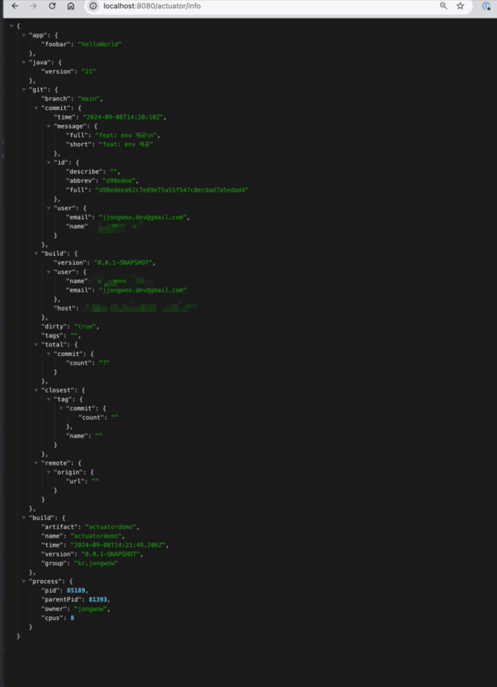

# What Actuator Can Do?!

- 헬스 체크
- 지표 수집 및 모니터링 - Grafana + Prometheus 연동
- 애플리케이션 정보 제공
  - Git, Env, Build, ...
  - [링크](https://docs.spring.io/spring-boot/how-to/properties-and-configuration.html#howto.properties-and-configuration.expand-properties)
  - 

  
